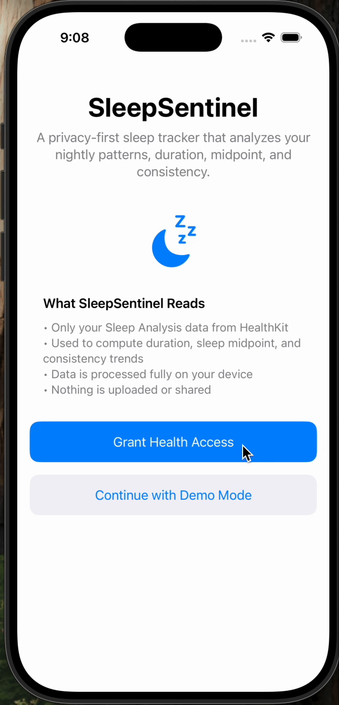

# SleepSentinel  
A privacy-first sleep insights app that analyzes nightly patterns, duration, efficiency, midpoint, and consistency.  
Built for the MDI1-111 course assignment.

---

## Overview
SleepSentinel integrates HealthKit sleep data with optional low-power motion fusion heuristics to infer sleep onset and wake when HealthKit data may be sparse.  
All data is processed entirely on-device, stored locally, and exported only when the user explicitly requests it.

The app includes:
- A clear permissions introduction
- Observer + Anchored HealthKit sync
- Nightly metrics computation
- Consistency & chronotype analytics
- Trends charts + per-night timeline
- Optional bedtime reminders
- Demo mode for Simulator testing
- Motion fusion for inferred onset/wake
- CSV export

---

## Features

### 1. **HealthKit Integration**
- Requests read access to **HKCategoryTypeIdentifier.sleepAnalysis**
- Uses:
  - **HKObserverQuery** to listen for new sleep samples
  - **HKAnchoredObjectQuery** to fetch delta updates efficiently
- Automatically caches sleep samples to disk
- Handles timezone and calendar day changes

### 2. **Nightly Metrics**
For each night, the app computes:
- Time **in bed**
- Time **asleep**
- Sleep **efficiency**
- Sleep **midpoint**
- Bedtime and wake time anchors

These are stored in the `SleepNight` model and kept sorted (newest first).

### 3. **Consistency Analytics**
- **Midpoint SD (7 days)**  
- **Social Jetlag (14 days)**
- **Regularity Index** based on user’s Sleep Plan  
- **Chronotype classification** (Early / Intermediate / Evening)

All metrics are computed on-device in the view model.

### 4. **Motion Fusion (Optional)**
Low-power motion fusion uses **CMMotionActivityManager** to detect:
- Sustained low-activity windows → inferred *sleep onset*
- Sustained high-activity windows → inferred *wake time*

The app surfaces:
- `inferredOnset`
- `inferredWake`

These are optional, clearly labeled, and never overwrite HealthKit data.

### 5. **Trends View**
- Bar + point chart showing nightly duration and midpoint
- Chronotype card
- Consistency summary card
- Scrollable list of nightly metrics

### 6. **Timeline View**
- Per-night horizontal bars
- Blue = asleep  
- Gray = in-bed  
- Normalized to max nightly duration
- Shows date, asleep hours, and efficiency

### 7. **Sleep Plan**
- User chooses target bedtime and wake time
- SwiftUI wheel-style time picker
- Adherence is computed from nightly bedtimes
- Optional bedtime reminders (10 minutes before target)

### 8. **Settings View**
Contains:
- HealthKit permissions status
- Toggle for demo mode
- Button to load demo data
- Bedtime reminder toggle
- Configure Sleep Plan navigation
- CSV Export
- Privacy & Data Policy

### 9. **CSV Export**
The user can export all computed nightly metrics.  
Implemented using a temporary file URL + native iOS share sheet.

### 10. **Onboarding Flow**
- Explains exactly what the app reads
- Describes privacy policy clearly
- Offers two options:
  - **Grant Health Access**
  - **Continue with Demo Mode** (for Simulator)

---

## Demo Mode (Simulator Support)
Since HealthKit is unavailable in the Simulator, the app includes:
- A built-in `DemoData` loader
- Automatic fallback when HK isn’t available
- Identical UI and analytics as live HealthKit data

---

## Architecture Summary

### **Model**
- `SleepNight`  
- `SleepSettings`

### **ViewModel**
- `SleepVM` (Main app state)
  - HealthKit sync
  - Aggregation
  - Consistency metrics
  - Motion fusion polling
  - CSV export
  - Cache load/save
  - Day/timezone rebuild logic

### **Motion**
- `MotionFusion`  
Optional helper for inferred onset/wake candidates.

### **Views**
- `OnboardingView`
- `MainView` (TabView)
  - `TrendsView`
  - `TimelineView`
  - `SettingsView`
- `SleepPlanPicker`
- `SleepPlanCard`
- `PrivacyView`

---

## Technical Notes

### HealthKit Capabilities
The Info.plist must include:
- NSHealthShareUsageDescription  
- NSHealthUpdateUsageDescription (if write is ever added)

The Xcode project must have the **HealthKit** capability enabled.

### File Storage
Two lightweight persisted files:
- `sleep_cache.json` for nightly metrics
- `hk_anchor.data` for anchored fetch resume

### Charting
The app uses **Swift Charts**, with fallback behavior printed in logs if dimension hints are missing.

### Motion Fusion Behavior
Motion data is optional.  
If `CMMotionActivityManager` isn’t available (Simulator), the app logs this but continues normally.

---

## Accessibility
- All charts and cards include VoiceOver-friendly labels
- Large text scales correctly
- Empty states provide instructions and actions

---

## Privacy
- All sleep data stays **completely local**
- No networking
- CSV export is only user-initiated
- Demo data never overwrites real HealthKit data unless chosen

---

## How to Run

### On Device
1. Enable HealthKit capability  
2. Add Info.plist permission strings  
3. Run on hardware  
4. Grant Health Access when requested  

### On Simulator
- Use **Load Demo Data** in Settings  
- Everything else works identically
